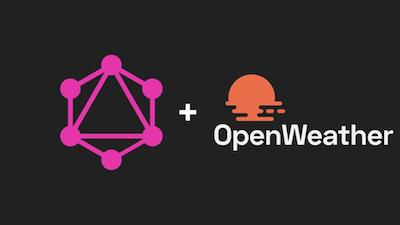

# Building a GraphQL API over a Public API



<!-- > -->

## Learning Outcomes

By the end of today's lesson, you should be able to...

1. Build a GraphQL API over a Public API


<!-- > -->

## Why are we doing this?

**Statement:** One use for GraphQL is building a better API on top of an existing API. 

**Questions For You:**

1. Describe why someone would make this statement? How can GraphQL improve an existing API?
1. Does a traditional, existing API have any advantages over GraphQL?

<!--
- Allows for an improved formatting of data
- Solves problems with over fetching
-->


## Setup

Today we will build a GraphQL API over the OpenWeatherMap API! 

1. Donwload the [sample project](https://github.com/Make-School-Courses/FEW-2.9-Technical-Seminar/tree/master/challenges/class-4)
1. Run `npm install` to install your dependencies
1. Create an account at [openweathermap.org](https://openweathermap.org/).
1. After you make an account, click on your username, then on `My API Keys`. Enter an API key name, then click the `Generate` button to create your API key!


<!-- v -->

### .env file

Having a `.env` file allows us to store our secrets (like an API Key) without it being exposed to the public on GitHub. Let's create that now so we can use our API Key in our project without exposing it!

1. In the folder containing the sample project, run `touch .env` in the terminal
1. Open the .env file, and place the following in it, replacing `MY_API_KEY` with your actual API Key:

```
OPENWEATHERMAP_API_KEY=MY_API_KEY
```

Save it when you're done. Alright, now we're ready to dive into it!

<!-- > -->

## Project Overview

In pairs, walk through the code and test out its existing functionality. Make sure you have answers to the following questions so we can review as a class:

1. What are the fields for the Weather schema?
1. Describe how each of the following resolvers work: `getAbout`, `getWeather`, and `fetchWeather`

Use the following to help answer your questions:

- [Openweather API docs](https://openweathermap.org/current). Check out the examples of API calls to see what the returned JSON looks like
- running the project with `npm start` and trying out the queries yourself at `localhost:4000/graphql`

<!-- > -->

## Challenges - pt 1

We measure air pollution using AQI. This was used a lot during the fire season in CA (or you could just use your nose, but that's besides the point).

Here we'll be using a new endpoint from OpenWeather to find the AQI for a given latitude and longitude.

**Challenges:** Complete Challenges 1-3 in `server.js`

**Hints:**

1. [Documentation](https://openweathermap.org/api/air-pollution) is your friend!
1. test as you go through running queries at `localhost:4000/graphql`

**Stretch challenge:** 

- What if someone puts in an incorrect latitude or longitude? Put in safeguards for this and return an appropriate error!
- use other endpoints from OpenWeatherMap and create more queries!

<!-- > -->

## Challenges - pt 2

Alright, now let's dive into some more complex queries!

**Challenge:** Complete challenge #5 and build a query that gives data on air pollution and weather for a given zip code!

**Stretch challenge:** use other endpoints and mix them up too! Make new combos

Make sure to utilize the [API Docs](https://openweathermap.org/api) to see what's available to you!

<!-- > -->

## Lab

Work on finishing [GrapQL Node tutorial](https://www.howtographql.com/graphql-js/0-introduction/)