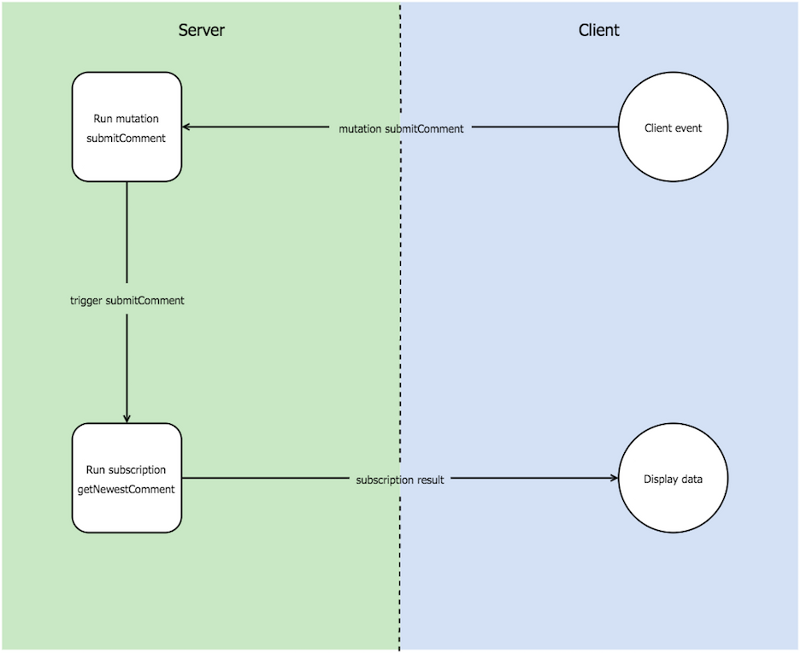

# Mutations in GraphQL


_source: [Command Query Responsibility Segregation with GraphQL](https://techblog.commercetools.com/modeling-graphql-mutations-52d4369f73b1)_

<!-- > -->

## Before We Get Started...

Are there any questions from the previous class or assignments that I can answer?

<!-- > -->

## Warmup - Queries

[Download the source code](https://github.com/makinhs/node-graphql-tutorial) for this example. Follow the `First things first` section in the README. Then navigate to `localhost:3000/graphql` in your browser

In this example there are `users` and `products` with the following fields

**users**

- id
- firstName
- lastName
- password
- permissionLevel
- email

**products**

- id
- name
- description
- price

Given the above, use queries to find answers to the following questions:

1. what is the `firstName` of all users in the database?
1. What is the `price` of the product with an id of `2`

<!--firstNames are Marcos and Silva, price = 250-->

<!-- > -->

## Learning Outcomes

By the end of today's lesson, you'll be able to...

1. Use mutations write to a database using GraphQL

<!-- > -->

## What are Mutations?


_source: [Command Query Responsibility Segregation with GraphQL](https://techblog.commercetools.com/modeling-graphql-mutations-52d4369f73b1)_

Similar to how we do a POST with a REST API, GraphQL utilizes mutations.

A **Mutation** is how you write to a databse using GraphQL.

<!-- > -->

## Example

We write mutations in a similar way we do queries:

```
# 1
mutation {
    # 2
    product(name: "Frogbat", id:3, price:500, description: "This will blow your mind") {
        # 3
        id,
        name,
        description,
        price
    }
}
```

Let's review the 3 parts above:

1. We start with the word `mutation` to signify that we will be writing to the database, and that this is different from a query
1. We specify what we will be writing into the database. In this case, we're creating a new product, and giving it values for all the required arguments. Here, `product` is our _root field_, or the name of the function we utilize to create a new product.
1. We specify our _payload_, or what we want returned after a successful mutation. Here we want all of the fields for the new product, but if we just wanted the `name` on return, then we would just write `name` in this section

Let's try writing some mutations ourselves!

<!-- > -->

## Challenges - Graphiql

Using the same sample code from the warmup, complete the following challenges

1. Write a mutation for a new product of your own, but the price must be 1000
1. Write a mutation for a new user using the `user` root field (remember, users need an id, firstName, lastName, password, permissionLevel, and email)
1. What happens if you try to create a new user, but don't include an id? Or if they have all fields except firstName? Why does this happen?

**Stretch Challenges**

Imagine you have a `Student` object, who has `name`, `age`, `track`, and `favoriteFood` fields, and you're building a GraphQL Schema for it:

1. How would you define a query type with root field `allStudents` who returns all students in the database?
1. How would you define a mutation type with root field `createStudent` who requires a name, age, and track, and writes a new student to the database?

<!-- > -->

## Challenges - Code

1. Download [this starter code](./challenges/class-3)
1. Run `npm install` and `npm start` 
1. Open a browser tab to `localhost:4000/graphql` to use for testing queries/mutations

Complete challenges 1-5 within `server.js`, and test your code by running queries/mutations in the browser

**Stretch Challenge**

Create more types/classes/resolvers and build a larger schema! What else can you build besides Users and Posts?

<!-- > -->

## Subscriptions - Intro



_source: [morioh.com](https://morioh.com/p/7439f3ecf2ce)_

Wouldn't it be great if we were able to update our front-end based off of changes (mutations) that happen on the server? Fear not, we can do exactly that!

**Subscriptions** in GraphQL allow us to have a realtime connection to the server in order to get immediately informed about important events.

- The client subscribes to an event, which allows it to hold a steady connection to the server so that it can accept data.
- Whenever that event happens, the server pushes the requested data down to the client

Subscriptions are written using the same syntax as queries and mutations:

```
subscription {
    newPost {
        content
    }
}
```

Here we have a subscription where after a new post is created, the `content` of that post is sent to the client.

<!-- v -->

### Question

What are some example scenarios in which you would use subscriptions?

#### Until Next Time...

We will revisit subscriptions after we have a better understanding of how to build out both the server and client aspects of GraphQL apps. 

## Lab

Continue to work on [GraphQL Node Tutorial](https://www.howtographql.com/graphql-js/0-introduction/)